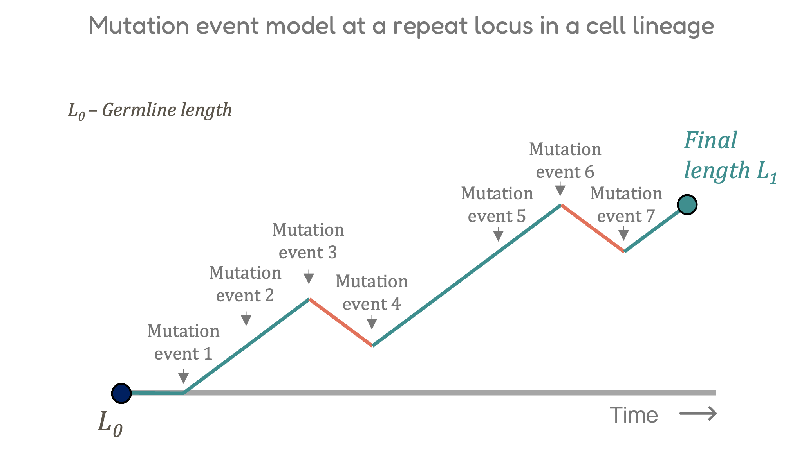

# inSTRbility


inSTRbility is a toolkit to analyse somatic instability at tandem repeat loci from whole genome sequencing datasets.

The tools includes two modules:

1. `extract`: Extracts reads mapping to repeat loci and records variations within the repeat region along with SNPs outside of the repeat. The output is a tab-delimited file with information about each read including allele length, haplotype, and methylation information.

2. `model`: Models the read allele length distribution at each locus to estimate the instability of the repeat locus based on the extracted reads.

The basic pipeline of the tool includes fetching reads mapping to repeat region and recording variations within the 
repeat region along with SNPs outside of the repeat. The variations falling within the repeat region contribute towards
calculation of the allele length in the read. Based on the SNP the reads are segregated into two haplogroups. The allele
length for each group is calculated as the mode of the group. For each read instability is calculated as the mean absolute
deviation from the allele length.

<b>NOTE:</b> The tool currently works on long read sequencing datasets including PacBio and ONT. 

## Installation

```bash
git clone https://github.com/dashnowlab/inSTRbility.git

cd inSTRbility

python setup.py install
```
## Usage for `extract`

### Printing help
```bash
$ python ./inSTRbility/extract_reads.py -h
```

### Basic usage
```bash
$ python ./inSTRbility/extract_reads.py -ref [fasta] -bed [regions_file] -bam [aln_file] -o [output_file] --reads-out
```

## Usage for `model`

### Basic usage
```bash
$ python ./inSTRbility/calc_instability.py -i [input_file] -o [output_file] [-v [vcf_file]]
```

### Input TSV file

The input file for the instability calculation is a tab-delimited file with the following columns:
| Column | Description |
|--------|-------------|
| chromosome | Chromosome |
| start | Start position |
| end | End position |
| individual | Sample ID |
| repeat motif | Repeat motif |
| read_id | Read ID |
| haplotype | Haplotype ID |
| allele_length | Allele length in the read |
| sequence | Sequence of the repeat locus in the read. Optional:  |
| avg_meth | Average methylation in the repeat locus in the read |
| nmeth_bases | Number of methylated bases in the repeat locus in the read |


## Mutation model for calculating instability
inSTRbility models the read distribution of a repeat locus based on a compound negative binomial geometric distribution. 
The model is fitted to the read distribution and the parameters are used to calculate the instability of the locus. The
model uses the geometric distribution to the model the size of the expansion or contraction step size in each mutation event.
The model uses the negative binomial distribution to model the number of mutation events in a cell lineage at a given locus.




### Scripts for extracting reads
- `__init__.py`
- `extract_reads.py`
- `cigar_utils.py`
- `cstag_utils.py`
- `md_utils.py`
- `genotype_utils.py`
- `phasing_utils.py`
- `instabillity_utils.py`
- `process_reads.py`
- `locus_utils.py`
- `operation_utils.py`
- `version.py`

### Scripts for modelling instability
- `calc_instability.py`
- `parse_inputs.py`
- `suggest_re_rc_grid.py`
- `nbgeom_modelling.py`
- `compress_bed.py`
- `calibrate.py`
- `check_lock.py`
- `multisample-analysis.py`
